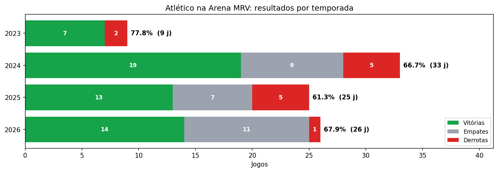
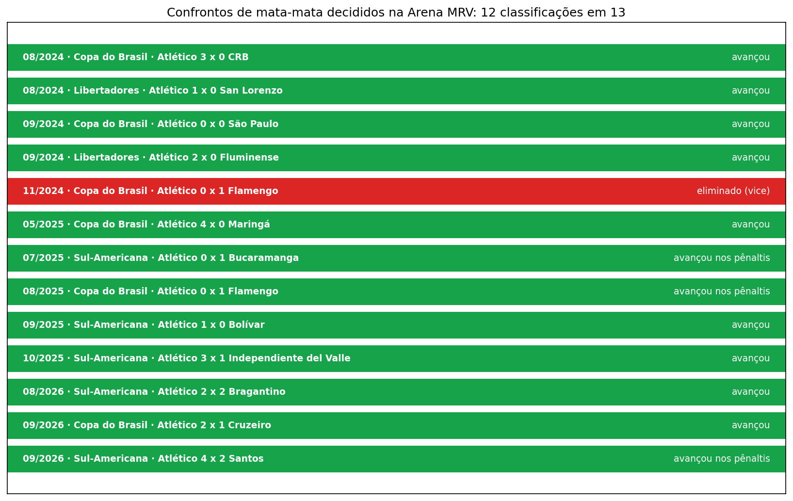
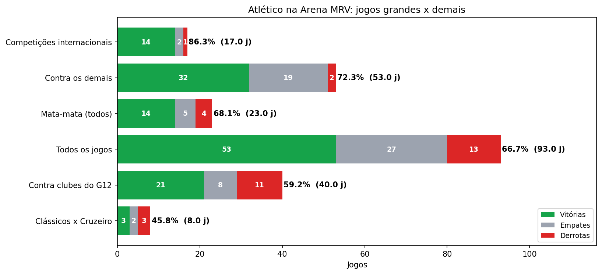
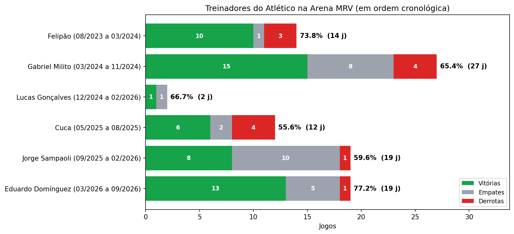

# O Atlético na Arena MRV

A Arena MRV virou um alçapão? Este projeto analisa **todos os 93 jogos do Atlético-MG na Arena MRV**, da inauguração, em agosto de 2023, até setembro de 2026: aproveitamento geral, desempenho em mata-mata, nos jogos grandes, nos clássicos e com cada treinador.

> Dados até **19/09/2026**. Base conferida com o levantamento oficial do clube: **93 jogos, 53 vitórias, 27 empates e 13 derrotas (66,67% de aproveitamento)**.
>
> Outros projetos: [Dinheiro e Desempenho no Brasileirão 2026](https://github.com/enriquefroes/futebol-dinheiro-e-desempenho) · [Reforços e saídas de Atlético-MG e Cruzeiro](https://github.com/enriquefroes/reforcos-galo-cruzeiro-2026) · [O peso do treinador no Brasileirão 2026](https://github.com/enriquefroes/treinadores-brasileirao-2026)

---

## Perguntas

| Notebook | Pergunta |
|---|---|
| `01_panorama` | Qual o desempenho do Atlético na Arena, no geral, por ano e por competição? |
| `02_mata_mata_e_jogos_grandes` | Como o time se comporta quando o jogo vale mais: mata-mata, G12, clássicos e competições internacionais? |
| `03_treinadores` | Qual treinador teve o melhor desempenho na Arena? |

## A Arena em números

| | |
|---|---|
| Jogos | 93 |
| Vitórias, empates e derrotas | 53 · 27 · 13 |
| Aproveitamento | 66,7% |
| Jogos sem perder | 80 (86%) |
| Gols marcados e sofridos | 158 · 87 (1,70 e 0,94 por jogo) |
| Jogos sem sofrer gol | 35 |
| Placar mais comum nas vitórias | 2 × 1 (14 vezes) |
| Maior invencibilidade | 13 jogos (jul–out/2024), **igualada pela sequência atual**, iniciada após a derrota para o Flamengo em abril de 2026 |

---

## Principais resultados

### 1. Por temporada e competição



| Temporada | Jogos | V-E-D | Aproveitamento |
|---|---|---|---|
| 2023 | 9 | 7-0-2 | 77,8% |
| 2024 | 33 | 19-9-5 | 66,7% |
| 2025 | 25 | 13-7-5 | 61,3% |
| 2026 | 26 | 14-11-1 | 67,9% |

| Competição | Jogos | V-E-D | Aproveitamento |
|---|---|---|---|
| Libertadores | 6 | 6-0-0 | **100%** |
| Sul-Americana | 11 | 8-2-1 | 78,8% |
| Brasileirão | 54 | 29-17-8 | 64,2% |
| Copa do Brasil | 11 | 6-2-3 | 60,6% |
| Mineiro | 11 | 4-6-1 | 54,5% |

Nas **competições internacionais**, o Atlético tem 14 vitórias, 2 empates e apenas 1 derrota em 17 jogos (86,3%). Na Libertadores, venceu todos os jogos que disputou na Arena. O ponto mais fraco, curiosamente, é o Mineiro.

### 2. Mata-mata: 12 classificações em 13 confrontos decididos em casa



O Atlético decidiu 13 confrontos de mata-mata na Arena e avançou em 12. A única eliminação foi a final da Copa do Brasil de 2024, contra o Flamengo.

Um detalhe importante: **em 4 dessas classificações, o Atlético não venceu o jogo da Arena**. Avançou nos pênaltis contra Bucaramanga e Flamengo (ambos em 2025), segurou um 0 a 0 com o São Paulo (2024) e empatou em 2 a 2 com o Bragantino (2026). Avançar em casa e vencer em casa são coisas diferentes.

| Tipo de jogo | Jogos | V-E-D | Aproveitamento |
|---|---|---|---|
| Fase de grupos (continental) | 8 | 7-1-0 | 91,7% |
| Mata-mata: jogo de ida | 7 | 5-1-1 | 76,2% |
| Mata-mata: jogo decisivo | 13 | 8-2-3 | 66,7% |
| Brasileirão | 54 | 29-17-8 | 64,2% |
| Mineiro: mata-mata | 3 | 1-2-0 | 55,6% |
| Mineiro: fase inicial | 8 | 3-4-1 | 54,2% |

### 3. Jogos grandes: o ponto fraco



| Recorte | Jogos | V-E-D | Aproveitamento |
|---|---|---|---|
| Contra clubes do G12 | 40 | 21-8-11 | 59,2% |
| Contra os demais | 53 | 32-19-2 | 72,3% |
| Clássicos contra o Cruzeiro | 8 | 3-2-3 | 45,8% |

**11 das 13 derrotas na Arena foram para clubes do G12.** Contra os demais adversários, o Atlético perdeu só duas vezes em 53 jogos (Coritiba, em 2023, e Bucaramanga, em 2025). Flamengo e Palmeiras são os algozes: juntos, respondem por 6 das 13 derrotas. Nos clássicos, o retrospecto é equilibrado, com 3 vitórias para cada lado.

### 4. Treinadores



| Treinador | Jogos | V-E-D | Aproveitamento | Mata-mata | Contra o G12 |
|---|---|---|---|---|---|
| Felipão | 14 | 10-1-3 | 73,8% | 1 jogo | 66,7% |
| Gabriel Milito | 27 | 15-8-4 | 65,4% | 74,1% (9 jogos) | 59,0% |
| Cuca | 12 | 6-2-4 | 55,6% | 40,0% (5 jogos) | 38,9% |
| Jorge Sampaoli | 19 | 8-10-1 | 59,6% | 2 jogos | 47,6% |
| **Eduardo Domínguez** | 19 | 13-5-1 | **77,2%** | 73,3% (5 jogos) | **79,2%** |
| Lucas Gonçalves (interino) | 2 | 1-1-0 | 66,7% | 1 jogo | — |

**Eduardo Domínguez** tem o melhor aproveitamento da história da Arena, inclusive contra o G12, com apenas uma derrota. **Gabriel Milito** é quem mais comandou o time no estádio (27 jogos). **Jorge Sampaoli** chama atenção pelos empates: 10 em 19 jogos.

---

## Metodologia

### Dados

- **Jogos:** todos os jogos oficiais do time profissional masculino do Atlético na Arena MRV. Base principal: levantamento oficial do Clube Atlético Mineiro (até 29/08/2026), completado com os jogos seguintes a partir do site do clube e da imprensa (Cruzeiro, Fluminense, Santos e Chapecoense, em setembro de 2026).
- **Treinadores:** períodos de cada treinador a partir das datas de contratação e demissão divulgadas pelo clube e pela imprensa. Interinos incluídos (Lucas Gonçalves comandou dois jogos na Arena: Athletico-PR, em dezembro de 2024, e América-MG, em fevereiro de 2026).

### Classificação dos jogos

| Categoria | Critério |
|---|---|
| **Mata-mata decisivo** | Jogo na Arena que definiu o confronto eliminatório (volta ou jogo único), conforme a lista oficial do clube |
| **Mata-mata ida** | Primeiro jogo de confronto eliminatório disputado na Arena |
| **Mineiro: mata-mata** | Semifinais e finais do estadual |
| **G12** | Botafogo, Corinthians, Cruzeiro, Flamengo, Fluminense, Grêmio, Internacional, Palmeiras, Santos, São Paulo e Vasco (além do próprio Atlético) |
| **Competições internacionais** | Libertadores e Sul-Americana |

Nos jogos decisivos, a coluna `confronto` indica se o Atlético avançou, inclusive nos pênaltis. No aproveitamento, todo jogo conta pelo placar do tempo normal; a disputa de pênaltis só aparece na coluna `confronto` (por exemplo, a derrota por 1 a 0 para o Flamengo em 2025 conta como derrota, mesmo com a classificação nos pênaltis).

---

## Limitações

- **Contextos diferentes entre treinadores.** Cada um pegou um momento distinto: elencos, calendários e competições diferentes. O aproveitamento na Arena não mede apenas o trabalho de cada treinador.
- **Amostras pequenas em alguns recortes.** Clássicos (8 jogos), Libertadores (6) e mata-mata do Mineiro (3) têm poucos jogos, e um resultado muda bastante o percentual.
- **Sem comparação fora de casa.** O estudo olha só para a Arena. Uma próxima etapa é comparar com os jogos como visitante e com o desempenho no Mineirão nos anos anteriores.
- **Público não incluído.** O efeito da torcida é discutido, mas não medido diretamente.

---

## Como rodar

1. Abra o [Google Colab](https://colab.research.google.com) e faça upload de `notebooks/00_dados.ipynb`.
2. Rode todas as células e autorize o acesso ao Google Drive. O notebook cria a pasta `MeuDrive/analise_arena_mrv/` com as bases.
3. Rode os notebooks 01 a 03. Gráficos e tabelas são salvos em `graficos/` e `tabelas/`.

**Para atualizar:** acrescente os novos jogos em `dados/jogos_arena_mrv.csv` e rode os notebooks de novo.

## Estrutura

```
├── notebooks/   00_dados + 3 análises
├── dados/       jogos_arena_mrv.csv, treinadores_atletico.csv
├── graficos/    PNGs gerados pelos notebooks
└── tabelas/     CSVs com os resultados de cada análise
```


---

**Autor:** Enrique Froes Nepomuceno · [LinkedIn](https://www.linkedin.com/in/enrique-froes-nepomuceno) · Projeto de estudo em análise de futebol.
